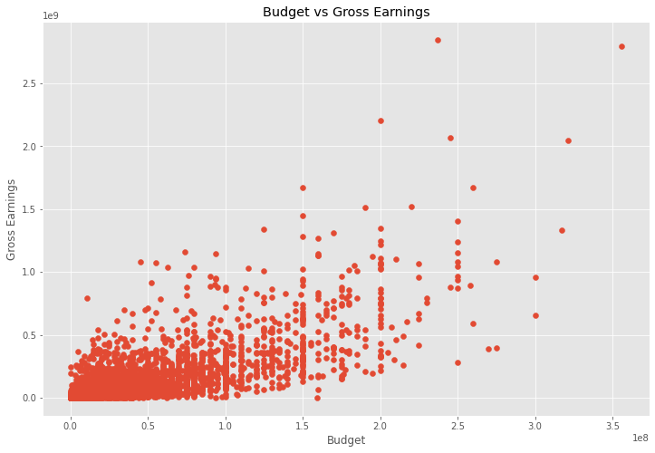
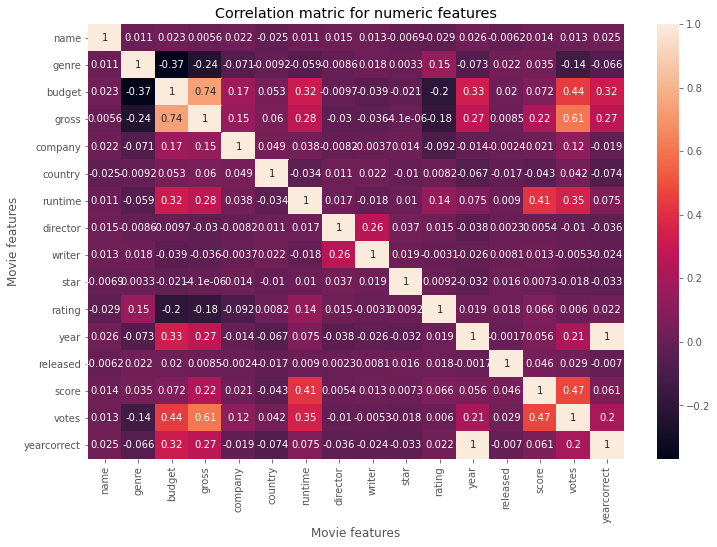

# Movie Data Analysis 

<div align='center'> 
    

</div>

This project focuses on analyzing movie data using Python and various libraries such as Pandas, NumPy, Matplotlib, and Seaborn. The project aims to explore the dataset, identify correlations between different movie features, and visualize the findings.

## Installation

To run this project, you need to have Python installed. To create a Conda environment in your Anaconda terminal, you can follow these steps:

1. Open the Anaconda terminal.

2. Execute the following command to create a new Conda environment named `myenv`:

```
conda create --name myenv --file requirements.txt
```

3. Activate the environment by running the appropriate command based on your operating system:

   - For Windows:
     ```
     conda activate myenv
     ```

   - For Linux and macOS:
     ```
     source activate myenv
     ```


4. Now you can use the newly created Conda environment with the installed libraries for your project.

Remember to replace `myenv` with the desired name for your Conda environment.

## Description of Columns

Here is a description of each column in the dataset:

- **name**: The name of the movie.
- **genre**: The genre or category of the movie.
- **budget**: The budget of the movie.
- **gross**: The gross earnings or revenue generated by the movie.
- **company**: The production company or studio behind the movie.
- **country**: The country of origin of the movie.
- **runtime**: The duration or length of the movie in minutes.
- **director**: The director of the movie.
- **writer**: The writer or screenwriter of the movie.
- **star**: The main actor or star of the movie.
- **rating**: The rating or classification assigned to the movie.
- **year**: The year when the movie was released.
- **released**: The release date of the movie.
- **score**: The score or rating assigned to the movie.
- **votes**: The number of votes or ratings received by the movie.


## Notebook

1. Import the required libraries:

```python
import pandas as pd
import numpy as np
import matplotlib.pyplot as plt
import seaborn as sns
```

2. Read the movie data:

```python
df = pd.read_csv('movies.csv')
```

3. Explore the dataset:

- View the first few rows of the dataset:

```python
df.head()
```

- Check the number of rows and columns:

```python
df.shape
```

- Check for null values:

```python
df.isnull().sum()
```

4. Data Cleaning and Transformation:

- Drop null values:

```python
df.dropna(inplace=True)
```

- Change data types:

```python
df['budget'] = df['budget'].astype('int64')
df['gross'] = df['gross'].astype('int64')
```

- Extract year from the released date:

```python
df['yearcorrect'] = df['released'].astype(str).str.split(',').str[1].str[:5].str.strip().astype('float').astype('Int64')
```

5. Data Visualization:

- Scatter plot of budget vs. gross earnings:

```python
plt.scatter(x=df['budget'], y=df['gross'])
plt.title('Budget vs Gross Earnings')
plt.xlabel('Budget')
plt.ylabel('Gross Earnings')
plt.show()
```
<div align='center'> 
    

</div>

- Heatmap of correlation matrix:

```python
correlation_matrix = df.corr(method='pearson')
sns.heatmap(correlation_matrix, annot=True)
plt.title('Correlation matrix for numeric features')
plt.xlabel('Movie features')
plt.ylabel('Movie features')
plt.show()
```
<div align='center'> 
    

</div>
6. Correlation Analysis:

- Calculate correlation between columns:

```python
correlation_matrix = df.corr(method='pearson')
```

- Sort and view correlation pairs:

```python
corr_pairs = correlation_matrix.unstack()
sorted_corr_pairs = corr_pairs.sort_values()
```

- Identify pairs with high correlation:

```python
high_corr = sorted_corr_pairs[(sorted_corr_pairs > 0.5)]
```

## Contributing

Contributions to this project are welcome. If you have any suggestions or improvements, feel free to submit a pull request.

**Contact Information** <a name="contact"></a>

<table>
  <tr>
    <th>Name</th>
    <th>Twitter</th>
    <th>LinkedIn</th>
    <th>GitHub</th>
    <th>Hugging Face</th>
  </tr>
  <tr>
    <td>Bright Eshun</td>
    <td><a href="https://twitter.com/bright_eshun_">@bright_eshun_</a></td>
    <td><a href="https://www.linkedin.com/in/bright-eshun-9a8a51100/">@brighteshun</a></td>
    <td><a href="https://github.com/Bright136">@bright136</a></td>
    <td><a href="https://huggingface.co/bright1">@bright1</a></td>
  </tr>
</table>